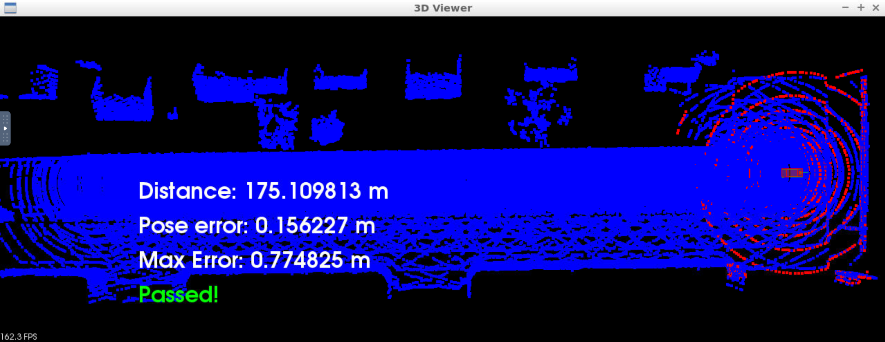

## Scan Matching Localization(NDT)

If you have appropriately implemented the steps above, you should be able to drive the vehicle at least 170 meters without the pose error rising above 1.2 meters, at an at least medium speed (three up arrow taps in the workspace). Additionally, the transformed point cloud should be appropriately rendering.

